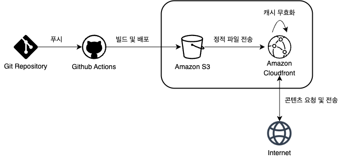

# 프론트엔드 배포 파이프라인



## 배포 파이프라인 구성 요소

1. Git Repository: 프로젝트를 관리하는 저장소
2. Github Actions: 자동화된 빌드와 배포를 수행할 수 있는 도구
3. Amazon S3: 정적 파일을 저장하는 클라우드 스토리지
4. Amazon Cloudfront: 콘텐츠를 빠르게 제공해주는 글로벌 CDN

## 배포 과정

1. 깃 저장소에 코드를 푸시하면 Github Actions 배포 워크플로우가 실행됩니다.
2. Next.js 앱이 빌드되고 생성된 빌드 폴더는 S3 버킷에 업로드 됩니다.
3. CloudFront를 통해 전세계 사용자에게 S3 정적 콘텐츠가 빠르게 제공됩니다.
4. CloudFront 캐시가 무효화되어 변경 사항이 즉시 반영됩니다.

## Github Actions 워크플로우 코드 분석

1. 워크플로우 트리거 조건
   ```
   on:
     push:
       branches:
         - main
     workflow_dispatch:
   ```
   - main 브랜치에 코드가 push됐을 때 자동으로 실행됩니다.
2. package-lock.json에 맞춰 의존성을 설치합니다.
   ```
   - name: Install dependencies
     run: npm ci
   ```
3. 프로젝트를 빌드합니다.
   ```
   - name: Build
     run: npm run build
   ```
4. AWS 자격 증명을 설정합니다.
   ```
   - name: Configure AWS credentials
     uses: aws-actions/configure-aws-credentials@v1
     with:
       aws-access-key-id: ${{ secrets.AWS_ACCESS_KEY_ID }}
       aws-secret-access-key: ${{ secrets.AWS_SECRET_ACCESS_KEY }}
       aws-region: ${{ secrets.AWS_REGION }}
   ```
   - secrets에 저장된 보안 정보를 사용해서 AWS key를 설정합니다.
5. out 폴더에 있는 빌드 결과물을 S3애 업로드합니다.
   ```
   - name: Deploy to S3
     run: |
         aws s3 sync out/ s3://${{ secrets.S3_BUCKET_NAME }} --delete
   ```
   - --delete 옵션은 S3에는 있고 out 폴더에는 없는 파일을 삭제해줍니다.
6. 기존 CloudFront 캐시 무효화
   ```
   - name: Invalidate CloudFront cache
     run: |
         aws cloudfront create-invalidation --distribution-id ${{ secrets.CLOUDFRONT_DISTRIBUTION_ID }} --paths "/*"
   ```
   - CloudFront에 캐시된 내용을 무효화해 새로 배포한 파일이 즉시 반영되도록 합니다.
   - 캐시 무효화는 S3에 업로드 된 결과물이 CloudFront에 배포 된 이후에 발생합니다.

## 주요 링크

1. S3 버킷 웹사이트 엔드포인트: <a href="http://optimization-4.s3-website.us-east-2.amazonaws.com/" target="_blank">http://optimization-4.s3-website.us-east-2.amazonaws.com/</a>
2. CloudFront 배포 도메인 이름: <a href="https://d31xxle60t1onn.cloudfront.net" target="_blank">https://d31xxle60t1onn.cloudfront.net</a>

## 주요 개념

1. Github Actions과 CI/CD 도구
   - Github Actions는 빌드, 테스트, 배포 과정을 자동화할 수 있는 CI/CD 플랫폼입니다.
   - 이슈 생성, 커밋 푸시, PR 생성 등 다양한 이벤트 발생 시 워크플로우가 실행됩니다.
   - 워크플로우는 `.github/workflows` 디렉토리에 정의된 YAML 파일을 통해 구성됩니다.
   - CI(Continuous Integration)는 '지속적 통합', CD(Continuous Deployment)는 '지속적 배포(또는 제공)'을 의미합니다.
2. S3와 스토리지
   - S3(Simple Storage Service)는 AWS에서 제공하는 객체 스토리지 서비스입니다.
   - S3에서는 데이터를 '객체' 단위로 저장하며, 이 객체들은 '버킷'이라는 컨테이너에 보관됩니다.
   - S3는 정적 웹사이트를 호스팅하는데 자주 사용되며, CloudFront와 함꼐 사용하면 전세계 사용자에게 콘텐츠를 빠르게 전달할 수 있습니다.
3. CloudFront와 CDN
   - CloudFront는 AWS에서 제공하는 CDN(Content Delivery Network) 서비스입니다.
   - CDN이란 전 세계 여러 지역에 분산된 엣지 서버(Edge Server)를 통해 사용자와 가장 가까운 서버에서 콘텐츠를 제공하는 방식입니다.
   - CloudFront는 정적 콘텐츠(HTML, JS, 이미지 등)를 엣지 로케이션에 캐싱하고 사용자와 가장 가까운 로케이션에서 빠르게 전달합니다.
   - 이를 통해 응답 속도를 높이고 원본 서버의 부하도 줄일 수 있습니다.
4. 캐시 무효화(Cache Invalidation)
   - 캐시 무효화는 기존에 캐싱된 데이터를 삭제하거나 갱신해 변경된 최신 콘텐츠를 사용자에게 제공할 수 있게 합니다.
   - CloudFront는 빠른 콘텐츠 제공을 위해 엣지 서버에 캐싱합니다.
   - 배포된 파일이 변경됐을 때, 동일한 경로의 콘텐츠는 기존 캐시가 유지되므로 바로 반영되지 않습니다.
   - 이 때, CloudFront의 캐시를 무효화해야 최신 파일이 사용자에게 전달됩니다.
   - `aws cloudfront create-invalidation` 명령어를 사용해서 특정 경로나 전체 캐시를 무효화할 수 있습니다.
5. Repository secret과 환경 변수
   - Github의 Repository secret은 외부에 노출되면 안 되는 민감한 값을 저장하기 위한 비밀 환경 변수입니다.
   - AWS 액세스 키, API 토큰과 같이 보안이 필요한 값들을 저장할 때 사용합니다.
   - Github Actions 워크플로우에서는 ${{ secrets.변수명 }} 형식으로 값을 참조할 수 있습니다.
